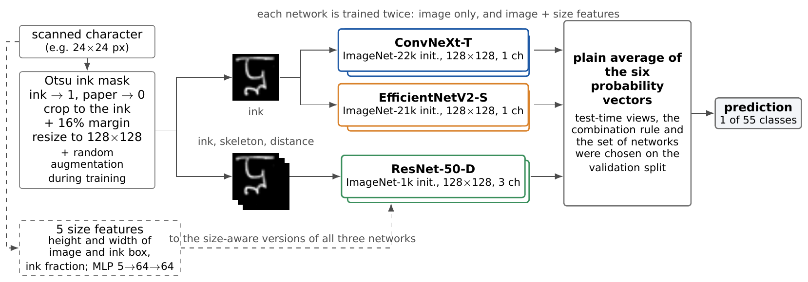

# Handwritten Meitei Mayek Recognition

Recognising handwritten Meitei Mayek characters (all 55 classes of the
TUMMHCD dataset) with ImageNet-pretrained CNNs, fine-tuned with augmentation
designed for handwriting.

**Live demo:** [huggingface.co/spaces/Chingkheinganba/handwritten-meitei-mayek-recognition](https://huggingface.co/spaces/Chingkheinganba/handwritten-meitei-mayek-recognition)
(runs in your browser) &nbsp;·&nbsp; **Trained networks:** [huggingface.co/Chingkheinganba/handwritten-meitei-mayek-recognition](https://huggingface.co/Chingkheinganba/handwritten-meitei-mayek-recognition)
&nbsp;·&nbsp; **Experiments:** [open in Colab](https://colab.research.google.com/github/chingkheinganba231005/Handwritten-Meitei-Mayek-Recognition/blob/main/notebooks/experiments.ipynb)



## Results

TUMMHCD has 85,124 isolated character images: 72,330 for training and 12,794
for testing. We hold out 15% of each training class (seed 42) for
validation, make every decision there, then retrain on all 72,330 training
images and evaluate on the test set.

| Network | Input | Validation (61,504 train) | Test (72,330 train) |
|---|---|---:|---:|
| ConvNeXt-T, ImageNet-22k | ink, 128 × 128, 5 views | 97.86% | 97.83% |
| EfficientNetV2-S, ImageNet-21k | ink, 128 × 128, 5 views | 97.88% | **97.95%** |
| ResNet-50-D, ImageNet-1k | ink + skeleton + distance, 1 view | 97.67% | 97.64% |
| Average of the three | | 98.07% | |

For comparison, the best published results on the same test set are 95.56%
([Hijam and Saharia, 2022](https://doi.org/10.1007/s00371-020-02032-y), CNN) and
97.08% ([Hijam and Saharia, 2024](https://doi.org/10.1007/s00371-023-02776-3),
multilevel feature fusion). Every network above beats both on its own.

Most of the remaining errors come from a handful of character pairs that
look almost the same in isolation, above all ꯢ (*i lonsum*) and ꯏ (*i*).
The notebook's error analysis, ablations, robustness tests and cost
measurements cover this in detail.

## How it works

**Preprocessing.** An Otsu threshold finds the ink. Ink is scaled to 1 and
paper to 0, so faint and dark scans look alike. The character is cropped to
its ink with a 16% margin, padded to a square and resized to 128 × 128. For
the ResNet the skeleton and the distance transform of that image become the
second and third channels.

**Networks.** Standard `timm` backbones with a new 55-way linear head, and
nothing else changed. The single-channel networks start from the pretrained
weights with the RGB filters of the first convolution summed.

**Training.** 60 epochs, AdamW (weight decay 0.05), batch 256, 3 warm-up
epochs then cosine decay, label smoothing 0.1, bfloat16 and an exponential
moving average of the weights (decay 0.9995), which is what gets evaluated.
Augmentation runs on the GPU: rotation, shear, scaling, translation, an
elastic warp, thicker or thinner strokes, gamma and contrast, blur, noise and
an occasional blanked-out patch. There are no flips, because a mirrored
character is a different character or none at all.

**Inference.** Each network uses one view or five (zoomed in and out by 6%,
shifted by 2 px), whichever was better on validation, and the ensemble
averages the probabilities.

**Demo.** The demo is a static web page: the EfficientNetV2-S network,
exported to ONNX, runs in the visitor's browser with ONNX Runtime Web, and
the preprocessing is reimplemented in JavaScript (`web/pipeline.js`, checked
against the Python version). A canvas drawing looks nothing like a 24-pixel
scan, so the page first thickens thin pen strokes to the dataset's relative
stroke width and shrinks the whole canvas to 24 px, then applies the usual
preprocessing.

## Reproducing the results

```bash
pip install -r requirements.txt
python -m mayek.split --data-dir data              # downloads TUMMHCD and writes the split CSVs
```

Everything else is in [`notebooks/experiments.ipynb`](notebooks/experiments.ipynb).
It runs on Colab (A100) and saves to Google Drive, so it resumes after a
disconnect. With an empty working folder it trains every model from scratch
(about 5 hours on an A100 for the full set of experiments). With saved
models it reuses them.

The dataset comes from its authors' page,
<http://agnigarh.tezu.ernet.in/~sarat/resources.html>. If the server is
unreachable, download `TUMMHCD-TEST-TRAIN.zip` in a browser and pass it with
`--zip`.

## Using the models

```python
from mayek.recognizer import Recognizer

rec = Recognizer("models")                 # config.json + one state dict per network
preds, seen = rec.predict("photo.jpg", source="upload")
for p in preds:
    print(p.cls.display, p.cls.id, p.cls.name, f"{p.prob:.1%}")
```

The trained weights are in the Hugging Face model repository:

```bash
huggingface-cli download Chingkheinganba/handwritten-meitei-mayek-recognition --local-dir models
python app.py                                  # a local Gradio demo of the full ensemble
```

## Repository layout

```
mayek/
  split.py        train / validation / test split (seed 42, 15% per class)
  preprocess.py   ink normalisation, cropping, skeleton, distance transform; demo rescaling
  data.py         image cache and the tensors training reads from
  augment.py      GPU augmentation and test-time views
  model.py        backbone + head, and the three configurations
  train.py        training loop, weight averaging, prediction
  ensemble.py     combining networks, pair specialists, error bookkeeping
  robustness.py   corruptions for the robustness tests
  cost.py         parameters, FLOPs, latency
  recognizer.py   inference on any image, and model export
  web.py          ONNX export and the static browser demo
web/              the browser demo (HTML, CSS, JavaScript)
app.py            local Gradio demo of the full ensemble
notebooks/        experiments.ipynb: every number in the paper
space/            cards for the Hugging Face Space and model repository
tests/            pytest
```

## Class 054

One class of the dataset has not been matched to a Unicode character yet.
The demo shows its class id instead of a glyph.

## Citation

If you use this code, please cite the dataset:

> D. Hijam and S. Saharia, "On developing complete character set Meitei Mayek
> handwritten character database," *The Visual Computer*, 38, 525–539 (2022).

and this repository (see [`CITATION.cff`](CITATION.cff)).

## License

MIT, see [LICENSE](LICENSE). TUMMHCD is distributed by its authors under
their own terms.
